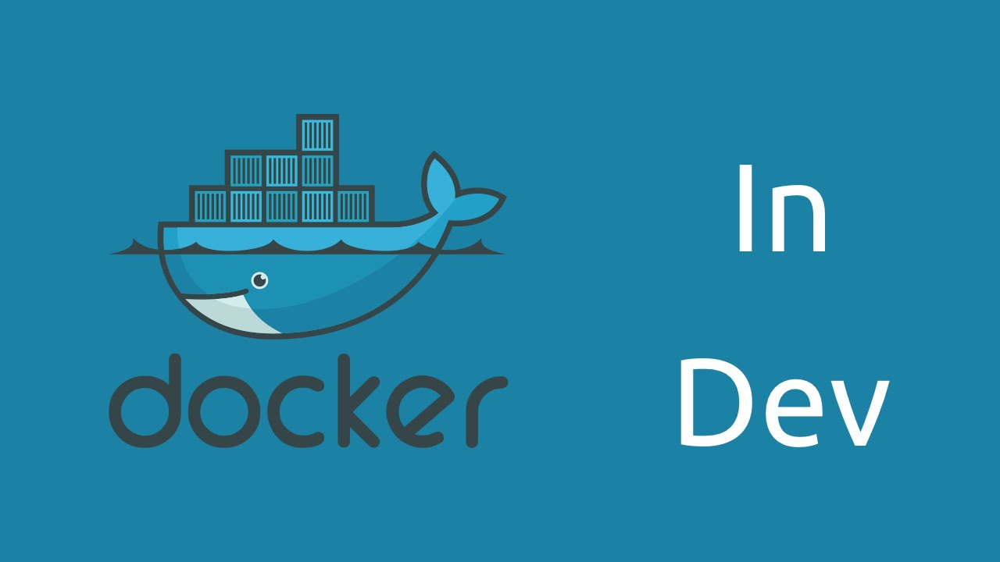

# Dockerify - WIP!



Dockerify is a WIP project for creating a development environment inside a container.

```sh
$ docker build -t test/latest .
$ docker run -it --name test test/latest zsh
$ docker image rm -f test/latest
$ docker start -i test (for stopped container)
```

```sh
$ docker commit test test_prod/latest
$ docker save test_prod/latest > /home/username/test_prod.tar
$ cat test_prod.tar | docker load
```

### Tech

Dockerify uses a number of open source projects to work properly:

- [Zsh] - Zsh is a shell designed for interactive use, although it is also a powerful scripting language
- [Oh-My-Zsh] - Oh My Zsh is a delightful, open source, community-driven framework for managing your Zsh configuration.
- [node.js] - evented I/O for the backend
- [Express] - fast node.js network app framework [@tjholowaychuk]

[//]: # "These are reference links used in the body of this note and get stripped out when the markdown processor does its job. There is no need to format nicely because it shouldn't be seen. Thanks SO - http://stackoverflow.com/questions/4823468/store-comments-in-markdown-syntax"
[node.js]: http://nodejs.org
[oh-my-zsh]: https://ohmyz.sh/
[zsh]: https://www.zsh.org
[@tjholowaychuk]: http://twitter.com/tjholowaychuk
[express]: http://expressjs.com
